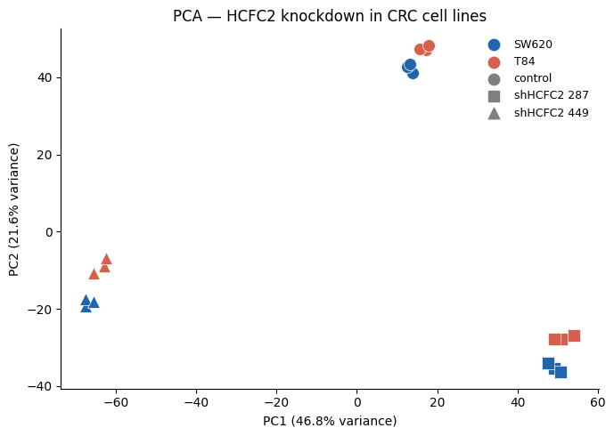
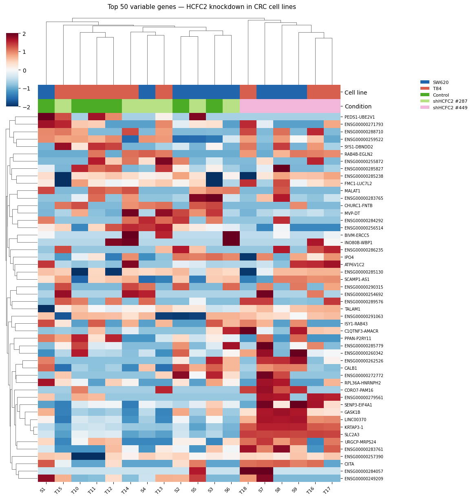
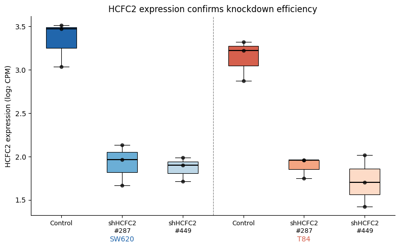
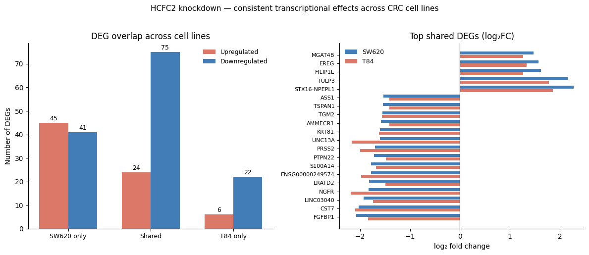

# Colorectal Cancer Biomarkers
### Computational Analysis of HCFC2 Knockdown Transcriptomics in CRC Cell Lines

## Overview
This project investigates the transcriptional consequences of HCFC2 knockdown in two 
colorectal cancer (CRC) cell lines using publicly available RNA-seq data (GSE335441). 
HCFC2 is a poorly characterised transcriptional cofactor; this analysis identifies genes 
consistently dysregulated upon its loss, pointing to a potential role in maintaining 
epithelial identity in CRC.

## Key Findings
- 99 genes were consistently dysregulated across both cell lines after HCFC2 knockdown
- 75 downregulated, including **CDH1** (E-cadherin, epithelial marker) and **NGFR**
- 24 upregulated, including **WASL** and **ARPC3** (actin remodelling, cell invasion)
- Both independent shRNA constructs produced consistent results, ruling out off-target effects

## Figures
| | |
|---|---|
|  |  |
|  |  |

## Data
- **Source:** NCBI GEO, accession [GSE335441](https://www.ncbi.nlm.nih.gov/geo/query/acc.cgi?acc=GSE335441)
- **Samples:** 18 RNA-seq samples: SW620 and T84 CRC cell lines
- **Conditions:** Non-targeting control, shHCFC2 #287, shHCFC2 #449 (3 replicates each)

## Methods
Raw counts were normalised to log₂ CPM. PCA was performed on the top 5,000 most variable 
genes. Differential expression was assessed using Welch's t-test with Benjamini–Hochberg 
FDR correction (|log₂FC| ≥ 1, FDR < 0.05).

## How to Run
Open the notebook directly in Google Colab, no local setup needed. Running all cells 
will generate 6 figures (PNG) and a results table (CSV) which are directly downloaded
to your computer.

## Requirements
Internet connection, if using Google Colab. 
